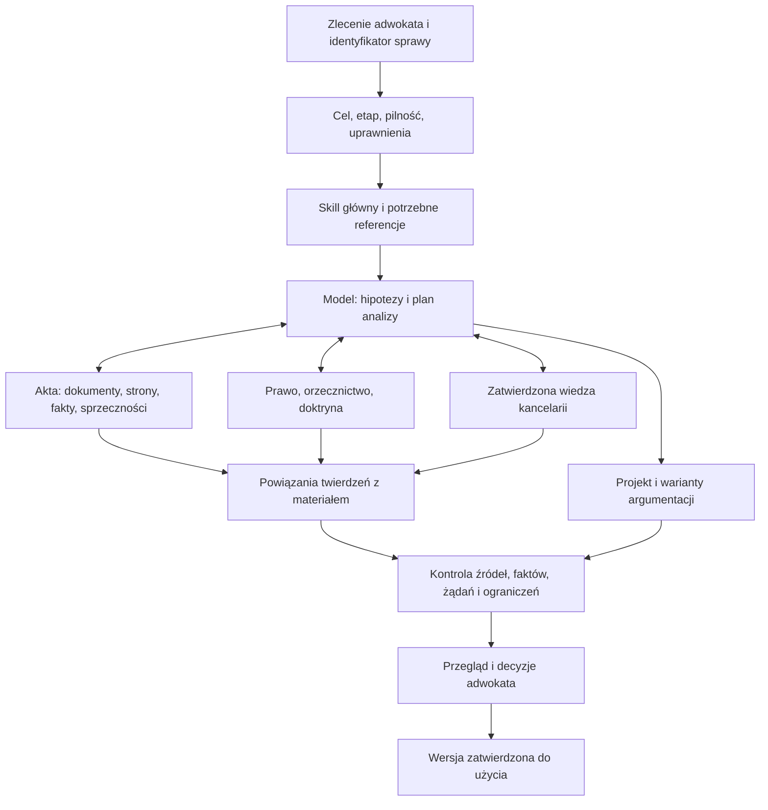

# Legal AI dla kancelarii — architektura v0.2

**Data przeglądu:** 22 września 2026 r.  
**Status:** rekomendowana architektura po recenzji; do pilotażu, nie deklaracja gotowości produkcyjnej.  
**Podstawa:** `legal-ai-architecture-v0.1-for-review.md` przekazany przez właściciela projektu.  
**Dokument towarzyszący:** [Recenzja i odpowiedzi na 35 pytań](legal-ai-review-v0.2-pl.md).

## 1. Decyzja projektowa

Budujemy środowisko pracy prawniczej, w którym model rozumuje, skille dostarczają sprawdzoną metodę, narzędzia dostarczają materiał, a adwokat kontroluje wynik i podejmuje decyzje zawodowe. Zachowujemy niezależność merytorycznej metody od konkretnego modelu.

Pierwszym produktem ma być **lepszy projekt pisma z wiarygodnym oparciem w aktach i źródłach**, a nie duża wyszukiwarka orzecznictwa. SAOS, embeddingi, osobny serwer i rozbudowane integracje są środkami, których wartość trzeba wykazać.

Względem v0.1 zmieniamy przede wszystkim:

| Obszar | Decyzja v0.2 |
|---|---|
| Prawo aktualne | Pierwszeństwo ma prawo właściwe dla sprawy, czasu i zagadnienia, także historyczne |
| Akta | Osobna warstwa dokumentów, odczytu, lokalizacji dowodów i kompletności |
| Kontrola adwokata | Każde pismo przeznaczone do wykorzystania wymaga przeglądu; eskalacja dotyczy dodatkowych decyzji |
| SAOS | Źródło do eksperymentu; pełna lokalna kopia po wykazaniu korzyści |
| Cytaty | Weryfikujemy konkretną tezę, jej fragment źródłowy i zastosowanie do sprawy |
| Bezpieczeństwo | Izolacja spraw i kontrola wysyłanych danych od pierwszego pilotażu z aktami |
| ChatGPT | Test możliwości, dystrybucji i kosztu na rzeczywistym koncie na początku |
| Cudzoziemcy | Mały moduł styku spraw karnych i pobytowych oraz PL/UA/RU już w pilotażu |
| Evals | Oddzielny pomiar metody, wyszukiwania, pisania i użyteczności dla adwokata |

To rekomendacje recenzenta. Deklaracji v0.1 o wcześniejszej akceptacji i ukończonym researchu nie traktujemy jako dowodu, że wszystkie opisane możliwości i źródła zostały już przetestowane.

## 2. Zakres kancelarii i pierwszego pilotażu

Docelowo: prawo i postępowanie karne, wykonanie orzeczeń, środki zapobiegawcze, prawo administracyjne, cudzoziemcy, legalizacja pobytu, zobowiązania do powrotu, ochrona międzynarodowa, ekstradycja, ENA oraz istotne prawo UE i EKPC.

Pierwszy pilotaż:

1. Analiza ograniczonego pakietu akt i uzasadnienia orzeczenia.
2. Koncepcja i projekt apelacji karnej.
3. Krytyczna recenzja istniejącego projektu pisma.
4. Rozpoznanie, czy sprawa wymaga osobnej analizy pobytowej lub językowej.

Apelacja pozostaje dobrym testem złożonym, ale pierwsza próba nie powinna wymagać przetworzenia wielotomowych akt. Zaczynamy od materiału, który adwokat może w całości sprawdzić. Praca pobytowa nie jest uznawana za obsłużoną tylko dlatego, że skill karny zauważył ryzyko.

Założenie robocze: narzędzie służy pracownikom kancelarii, a nie samodzielnemu udzielaniu porad klientom ani autonomicznemu wysyłaniu pism. Zmiana tego założenia wymaga osobnego projektu uprawnień i kontroli.

## 3. Możliwości platformy i model kosztowy

Dokumentacja OpenAI potwierdza format skilli oparty na `SKILL.md`, warunkowe wczytywanie instrukcji oraz dystrybucję skilli w pluginach. Rozróżnia lokalne foldery skilli i pluginy dostępne w różnych interfejsach ChatGPT. **Sam folder w repozytorium nie oznacza, że skill jest dostępny wszystkim pracownikom w każdym interfejsie.** [OpenAI — Build skills](https://learn.chatgpt.com/docs/build-skills).

Dokumentacja cenowa wskazuje wspólne wykorzystanie limitów przez Work i Codex, limity zależne od sposobu użycia oraz rozliczenia kredytowe. Nie zakładamy, że abonament usuwa koszt intensywnego researchu. Astra jest wymieniona w dokumentacji; dostępność wybranego modelu i konfiguracji w docelowym workspace wymaga sprawdzenia. [OpenAI — Pricing](https://learn.chatgpt.com/docs/pricing).

Przed wyborem Business albo Enterprise wykonujemy mały test na koncie docelowym:

| Co sprawdzić | Dowód powodzenia |
|---|---|
| Udostępnienie skilla zespołowi | Drugi użytkownik uruchamia właściwą, oznaczoną wersję |
| Uruchomienie jawne i automatyczne | Skill uruchamia się dla właściwego zadania, nie uruchamia dla podobnego, obcego zadania |
| Referencje i pliki | Model potrafi odczytać wskazany materiał i lokalizować fragmenty |
| Research i ewentualne MCP | Odczyt źródła działa z uprawnieniami danego pracownika |
| Aktualizacja i wycofanie | Zespół potrafi ustalić wersję i wrócić do poprzedniej |
| Eksport wyniku | Pismo i notatka kontrolna są możliwe do dalszej edycji |
| Zużycie i czas | Pomiar kilku reprezentatywnych zadań, z czasem kontroli adwokata |

Wybór pakietu uzależniamy od potrzeb kontroli dostępu, retencji, audytu i zarządzania zespołem, a także rzeczywistego kosztu pracy. Dokumentacja odróżnia podstawowe możliwości Business od dodatkowych kontroli Enterprise; szczegóły trzeba potwierdzić dla konkretnej umowy. Nie rekomendujemy zakupu wyłącznie dlatego, że pakiet „ma skille”. [OpenAI — Pricing](https://learn.chatgpt.com/docs/pricing).

Metoda prawna może być przenośna między modelami. Format instalacji, narzędzia, uprawnienia i limity wymagają adaptera do środowiska oraz testów po zmianie platformy. Brak dostępnego narzędzia ma prowadzić do jawnego ograniczenia analizy, nie do udawania wykonanej weryfikacji.

## 4. Zasady nadrzędne

1. **Metoda wspiera rozumowanie.** Skill zawiera wskazówki zmieniające decyzje modelu, nie podręcznik prawa i nie sztywną listę wszystkich możliwych argumentów.
2. **Właściwe prawo ma pierwszeństwo.** Ustalamy jurysdykcję, relewantne daty, przepisy przejściowe i zakres zastosowania. Najnowszy tekst nie zawsze rozstrzyga sprawę.
3. **Fakty mają pochodzenie i status.** Twierdzenie klienta, zarzut prokuratora, treść dokumentu, ustalenie sądu i wniosek modelu to różne kategorie.
4. **Cytujemy sprawdzone tezy.** Istnienie orzeczenia i zgodność sygnatury nie potwierdzają przypisanego mu stanowiska.
5. **Głębokość jest proporcjonalna do zadania i ryzyka.** Krótkie pytanie o termin może wymagać większej kontroli niż długi tekst redakcyjny.
6. **Niepewność jest konkretna.** Pokazujemy brak, jego wpływ i możliwe warianty; nie zastępujemy pracy ogólnym zastrzeżeniem.
7. **Ochrona danych i uprawnienia są egzekwowane technicznie.** Polecenie w skillu nie zastępuje kontroli dostępu.
8. **Zmiany mierzymy.** Nowa wersja ma wykazać określoną korzyść i brak niedopuszczalnej regresji; nie każda zmiana musi poprawiać każdą metrykę.
9. **Dokumenty źródłowe nie wydają poleceń agentowi.** Treść akt, orzeczeń, stron i wyników narzędzi jest materiałem analizy. Nie może zmienić uprawnień ani uruchomić wysyłki danych.
10. **Adwokat kontroluje użycie zawodowe.** Brak wykrytej niepewności przez AI nie oznacza zgody na samodzielne wykorzystanie pisma.

Model może odstąpić od zalecanego układu analizy, jeśli fakty lub prawo uzasadniają lepszy sposób. Ta elastyczność nie obejmuje wymyślania źródeł, omijania uprawnień ani przedstawiania nieprzeczytanego dokumentu jako sprawdzonego.

## 5. Architektura logiczna



Uprawnienia, izolacja spraw, rejestr wersji i kontrola jakości obejmują cały przepływ. Diagram przedstawia odpowiedzialności, nie wymóg budowania osobnych mikroserwisów. W pilotażu większość elementów może być plikiem, tabelą i pracą w jednym zadaniu.

Rozdzielamy trzy magazyny: publiczne źródła prawa; zatwierdzoną, uogólnioną wiedzę kancelarii; poufne materiały konkretnych spraw. Wspólny interfejs wyszukiwania nie może zacierać tych granic.

## 6. Skille i wspólna metoda

Na start rekomenduję dwa właściwe skille zadaniowe:

- `pl-criminal-appeal` — analiza możliwości zaskarżenia, koncepcja i projekt apelacji karnej.
- `pl-legal-document-review` — recenzja dokumentu w zakresie zleconym przez adwokata, z porównaniem z udostępnionymi aktami i źródłami.

Analiza akt jest wspólnym procesem wejściowym. Gdy będzie regularnie zlecana samodzielnie, wydzielamy `pl-case-file-analysis`. Jeśli kancelaria chce zachować nazwę `pl-criminal-case`, trzeba zawęzić opis uruchamiania, aby skill nie przejmował każdej rozmowy o prawie karnym.

Wspólne zasady źródeł utrzymujemy w jednym wersjonowanym materiale. Każdy skill musi mieć pewny, przetestowany sposób jego odczytania. Nie zakładamy automatycznego dziedziczenia instrukcji między skillami. Przy pakowaniu można dołączać generowaną kopię wspólnej referencji i sprawdzać zgodność wersji.

Referencje warunkowe obejmują: pracę z aktami, prawo w czasie, konstrukcję zarzutów i żądań, styki karne–pobytowe, języki i tożsamość, zasady źródeł. Wczytywane są wyłącznie wtedy, gdy wpływają na zadanie. Pełne postępowanie administracyjne, skarga do WSA, kasacja, ENA i ekstradycja mają własne wymagania — krótka referencja służy rozpoznaniu potrzeby dalszej analizy, nie zastępuje całego warsztatu.

### Dwie osie zamiast utożsamienia DEEP z FINAL

| Oś | Wartości | Znaczenie |
|---|---|---|
| Głębokość pracy | LIGHT / STANDARD / DEEP | Zakres researchu, alternatyw i kontroli |
| Stan wyniku | roboczy / do przeglądu / zatwierdzony przez adwokata | Możliwość wykorzystania konkretnej wersji |

LIGHT pozwala na hipotezy i wstępną ocenę bez szerokiego researchu, ale nie na niezweryfikowane cytaty przedstawiane jako pewne. STANDARD sprawdza podstawy materialne dla wniosku. DEEP dodaje szerszą analizę konkurencyjnych stanowisk i kontrolę istotnych ryzyk. Pilność, pozbawienie wolności, ryzyko powrotu, niejasne doręczenie albo brak kluczowej strony mogą automatycznie podnieść wymagany poziom kontroli.

Nie wykonujemy tego samego pełnego audytu przy każdej kosmetycznej poprawce. Zmiana merytoryczna ponownie otwiera zależne sprawdzenia; zmiana stylu wymaga kontroli, czy sens się nie zmienił.

### Ochrona jakości rozumowania

Najpierw model identyfikuje możliwe problemy i warianty, następnie sprawdza materiał i selekcjonuje argumenty. Nie musi wyświetlać użytkownikowi całego procesu. Wynik powinien zachować dobre argumenty, wskazać istotne alternatywy i wyjaśnić główne ograniczenia. Nie mierzymy kreatywności liczbą zarzutów ani długością tekstu.

## 7. Akta i dowody — element obowiązkowy

Przed analizą ustalamy, jakie dokumenty rzeczywiście są dostępne. Przy większym pakiecie tworzymy manifest: identyfikator dokumentu, nazwa, data, wersja, liczba stron, język, źródło, braki, stan odczytu i powiązanie ze sprawą.

**Odrębnie zapisujemy numer strony PDF i oznaczenie karty akt.** Tłumaczenie, OCR i streszczenie nie zastępują oryginału. Zmiana pliku lub ekstrakcji nie może przesunąć odwołań niezauważenie. Skrót pliku potwierdza tożsamość kopii, nie autentyczność ani prawdziwość treści.

Minimalny zapis istotnego twierdzenia:

```yaml
fact_id: F-017
matter_id: M-001
statement: "Treść ustalenia lub twierdzenia"
status: client_statement # albo document_content / court_finding / disputed / inference
source_document_id: D-004
source_version: "sha256:..."
pdf_page: 12
file_card: "k. 34v" # tylko jeśli oznaczenie rzeczywiście jest w materiale
passage: "Krótki fragment źródłowy"
language: pl
read_status: checked # albo uncertain_ocr / unreadable
conflicts_with: []
```

Rozróżniamy datę zdarzenia, datę dokumentu, datę orzeczenia i datę doręczenia. Dokument stwierdzający doręczenie też wymaga identyfikacji; model nie przyjmuje go na podstawie nazwy pliku.

Przy skanach sprawdzamy zwłaszcza negacje, liczby, daty, nazwiska, sygnatury i jednostki redakcyjne. Niepewny odczyt krytycznego fragmentu blokuje stanowczy wniosek zależny od tego fragmentu, ale nie musi blokować analizy pozostałych zagadnień.

Model podaje rzeczywisty zakres przeczytanego materiału. Wyszukanie kilku fragmentów wielotomowych akt nie uprawnia do stwierdzenia „przeanalizowano całe akta”. Chronologia i tabela sprzeczności mogą być pomocnicze, nie są obowiązkowym dodatkiem do każdego krótkiego zadania.

## 8. Polityka źródeł i twierdzeń

Zachowujemy pierwszeństwo źródeł pierwotnych dla treści prawa i obowiązek odczytania materiału przed cytowaniem. Rozszerzamy klasy o `MATTER_DOCUMENT`, `PARTY_STATEMENT`, `DOCTRINE`, `OFFICE_NOTE`, `TRANSLATION` i `MODEL_DERIVED`. To klasy pochodzenia materiału, a nie jedna skala jego mocy.

Każde istotne twierdzenie rozpoznajemy jako:

| Rodzaj | Właściwa podstawa |
|---|---|
| Treść przepisu | Właściwa wersja aktu i analiza zakresu zastosowania |
| Stanowisko sądu | Rzeczywisty tekst orzeczenia, fragment i kontekst |
| Pogląd doktryny | Autor, publikacja, czas, zakres i dokładne stanowisko |
| Praktyka organu | Źródło, data i właściwość danego organu |
| Fakt w sprawie | Dokument, strona/karta i status twierdzenia |
| Wniosek lub strategia | Jawnie wskazane przesłanki, rozumowanie i ryzyko |

Źródło urzędowe może zawierać niewiążącą informację. Orzeczenie może być istotne interpretacyjnie, ale jego rodzaj i znaczenie dla konkretnej sprawy trzeba ocenić oddzielnie. Nie wprowadzamy automatu „wyższy sąd = rozstrzygający argument” ani jednej liczby `authority_level` wystarczającej do wszystkich zastosowań.

Pamięć modelu pomaga formułować hipotezy i zapytania. Nie jest dowodem, że przepis lub orzeczenie ma określoną treść. Brak znalezionego źródła nie wyklucza samodzielnej argumentacji prawniczej; zakazuje jedynie udawania, że tę argumentację popiera nieodczytany autorytet.

### Weryfikacja cytatu ma dotyczyć tezy

Zamiast globalnego `proposition: true` przy orzeczeniu zapisujemy relację:

```yaml
claim_id: C-012
claim_text: "Dokładna teza użyta w analizie"
source_document_id: J-042
source_version: "sha256:..."
locator: "strona lub akapit"
supporting_passage: "Fragment z niezbędnym kontekstem"
speaker: court # albo party / quoted_other_court / editor
relation: supports # contradicts / limits / insufficient
text_match: checked
interpretation_review: model_checked # attorney_checked / disputed / unchecked
applicability_to_matter: pending
checked_at: "..."
checked_by: "..."
```

Program może sprawdzić obecność cytatu, lokalizację i zgodność identyfikatorów. Nie potwierdza tym poprawności interpretacji. Zmiana tezy wymaga ponownego sprawdzenia jej związku ze źródłem. Odnaleziony cytat z argumentacji strony nie staje się stanowiskiem sądu.

### Brak oficjalnej publikacji

Preferujemy pełny tekst z oficjalnego źródła. Jeżeli jest niedostępny, rozróżniamy: wcześniej zweryfikowaną kopię, odpis z akt, kopię z wiarygodnego innego źródła i sam opis bibliograficzny. Zapisujemy pochodzenie i ograniczenia. Użycie ważnego cytatu opartego na takim materiale pozostaje widoczną decyzją adwokata.

Nie ustanawiamy reguły „brak publicznego linku = orzeczenie nie istnieje”. Także brak wyniku ELI trzeba odróżnić od awarii, błędu identyfikatora lub złego adresu. Wyniki narzędzia mają stany: `not_found`, `unavailable`, `access_denied`, `parse_failed`, `partial`, `ok`.

## 9. Prawo w czasie i terminy

ELI udostępnia API, metadane aktów, relacje i materiały przydatne do weryfikacji. Dokumentacja opisuje również listę zmian danych. Sygnał zmiany w bazie nie oznacza jeszcze zmiany normy prawnej. [ELI — dokumentacja](https://api.sejm.gov.pl/eli_pl.html).

Dla istotnego problemu zapisujemy:

- daty zdarzeń i etap postępowania;
- datę, na którą ustalamy brzmienie przepisu;
- relewantne nowelizacje i przepisy przejściowe;
- podstawę zastosowania danej wersji do tego zagadnienia;
- datę sprawdzenia i niewyjaśnione kwestie.

W jednej sprawie różne zagadnienia mogą podlegać różnym regułom czasowym. Dotyczy to również relacji prawa materialnego, procedury i sytuacji pobytowej. `retrieved_at` nie jest datą obowiązywania, a świeżo pobrany tekst jednolity nie potwierdza sam przez się stanu na dzień zdarzenia.

Nie budujemy na start uniwersalnego silnika prawa historycznego. Potrzebujemy jednak od razu procedury i testów, które wykrywają zastosowanie złej wersji.

Obliczanie terminów dzielimy na wybór właściwej reguły i arytmetykę. Ustalenie zdarzenia początkowego, sposobu doręczenia, wyjątków i skutków wymaga materiału i oceny prawnej. Skrypt może policzyć datę dopiero po podaniu sprawdzonych parametrów i właściwego kalendarza. Brak danych daje wynik warunkowy, nie pozornie pewną datę.

## 10. Orzecznictwo i SAOS

SAOS dokumentuje osobne API wyszukiwania oraz hurtowego pobierania. To pierwsze może posłużyć do prototypu bez własnej kopii. W dokumentacji pobierania występuje `sinceModificationDate` służące pobieraniu zmian. Nie potwierdza to kompletności korpusu ani mechanizmu obsługi każdego usunięcia. [SAOS — wyszukiwanie](https://www.saos.org.pl/help/index.php/dokumentacja-api/api-przeszukiwania-danych), [SAOS — pobieranie](https://www.saos.org.pl/help/index.php/dokumentacja-api/api-pobierania-danych).

W pojedynczej próbie API podczas tej recenzji odpowiedź raportowała **541 921 wyników**. Sortowanie po dacie zwróciło m.in. daty `3013-12-04` i `2101-04-14`. To zaobserwowane anomalie metadanych, nie audyt całej bazy. Dowód zapisano w [notatce z próby](evidence/saos-api-check-2026-09-22.json). Nie wolno zatem opierać rankingu świeżości na niekontrolowanej dacie.

### Kolejność eksperymentu

1. Przygotować kilkadziesiąt pytań badawczych z ocenionymi przez adwokata trafnymi i mylącymi wynikami.
2. Zmierzyć ręczne/wbudowane wyszukiwanie oraz dostępne API.
3. Sprawdzić pokrycie SAOS: sądy, lata, dziedziny, aktualność, pełne teksty, duplikaty i odnośniki do źródeł.
4. Ocenić warunki wykorzystania danych i obciążania usługi przed masowym pobieraniem.
5. Dopiero potem wybrać mały lokalny korpus do porównania wyszukiwania tekstowego z hybrydowym.
6. Rozbudować kopię i synchronizację, jeśli wyniki uzasadniają utrzymanie serwera.

Nie zakładamy, że SAOS zapewni wystarczające pokrycie CBOSA, orzeczeń europejskich albo wszystkich bieżących spraw cudzoziemskich. Każdy obszar wymaga własnego sprawdzenia dostępności.

### Indeks i ranking

Przechowujemy niezmieniony pełny tekst oraz fragmenty z relacją do dokumentu. Podział powinien zachowywać części uzasadnienia, sąsiedni kontekst, negacje, zastrzeżenia i autora przytaczanego stanowiska. Punkt startowy eksperymentu to fragmenty około 500–1000 tokenów z niewielkim nakładaniem; te liczby są hipotezą do testu, nie ustalonym optimum dla polskiego prawa.

W pierwszej wersji nie trzeba generować streszczeń i tez całego korpusu. Późniejsze streszczenia modelowe służą odkrywaniu materiału i zawsze wskazują źródłowe fragmenty. Nie tworzą odrębnego autorytetu.

Ranking: dopasowanie sygnatury i przepisu, wyszukiwanie leksykalne, wyszukiwanie semantyczne, połączenie list, deduplikacja, a następnie ocena kilku najlepszych kandydatów pod kątem problemu prawnego. Przydatność zależy m.in. od etapu postępowania, wersji prawa, rodzaju rozstrzygnięcia i tego, czy sąd rzeczywiście rozstrzygał dane zagadnienie. Wynik przeciwny do stanowiska kancelarii może być bardzo wartościowy — nie obniżamy go za samą niekorzystną konkluzję.

Zalecany eksperymentalny punkt wyjścia to PostgreSQL z FTS i pgvector. PostgreSQL zapewnia konfigurowalne przetwarzanie tekstu; pgvector dokumentuje połączenie z FTS oraz łączenie rankingów. Polski wymaga rzeczywistego testu normalizacji i fleksji. **Zwykłe `ts_rank`/`ts_rank_cd` nie powinno być opisywane jako gotowe BM25.** [PostgreSQL — FTS](https://www.postgresql.org/docs/current/textsearch-intro.html), [pgvector — Hybrid Search](https://github.com/pgvector/pgvector#hybrid-search).

500 tys. orzeczeń nie wystarcza do wymiarowania serwera. Przykładowo 500 tys. dokumentów × 12 fragmentów to 6 mln wektorów. Przy 1024 wymiarach i 4 bajtach na wymiar same wartości wektorów zajmują około 24,6 GB, przed indeksami, tekstami i kopiami. To ilustracja rachunku, nie estymacja rzeczywistego SAOS ani rekomendacja konkretnego VPS.

Jeżeli istnieje kopia lokalna, synchronizacja wymaga idempotentnego zapisu, zapamiętania punktu wznowienia dopiero po trwałym zapisie danych, obsługi powtórzeń i poprawek, ponownego indeksowania zmienionych tekstów oraz wykrywania usunięć lub zmian anonimizacji. Nieodświeżona kopia nie może bezterminowo nadawać sobie statusu „aktualna”.

### Weryfikacja bez zbędnego opóźnienia

Oficjalną weryfikację wykonujemy dla orzeczeń, które mają realnie wejść do argumentacji, nie dla każdego wyniku wyszukiwania. Można zachować zweryfikowaną kopię wraz z pochodzeniem i odświeżać jej status zgodnie z ryzykiem. Weryfikację treści, historii/statusu orzeczenia i trafności konkretnej tezy traktujemy oddzielnie. Automatyczny adapter może powstać później; procedura weryfikacji obowiązuje od pierwszego pisma.

## 11. Doktryna i wiedza kancelarii

Otwarte publikacje i własne notatki są sensownym początkiem. Nie ma podstaw, by przed badaniem pokrycia uznać je za pełny zamiennik LEX/Legalis. System potrafi zgłosić konkretną lukę i przygotować pytanie, które adwokat sprawdzi w innym legalnie dostępnym źródle.

Minimalny korpus dobieramy do zagadnień pilotażu, nie liczby gigabajtów: zarzuty, granice kontroli, relacja błędów faktycznych i prawnych, żądania, materiał dowodowy, prawo w czasie i wybrane skutki dla cudzoziemca. Dla zagadnień spornych zapisujemy stanowiska przeciwne, zakres ich uzasadnienia i ograniczenia. „Nie znaleziono poglądu przeciwnego” nie oznacza zgodności doktryny.

Metadane praw do wykorzystania rozbijamy na konkretne operacje: pobranie, przechowanie, indeksowanie, embedding, przekazanie dostawcy, fragmenty w odpowiedzi i dalsze udostępnienie. `OPEN_RAG` jest wewnętrzną decyzją systemu, nie nazwą licencji. Wskazujemy podstawę, warunki, osobę oceniającą i datę. Własna notatka nie może być automatycznym sposobem na reprodukcję całego chronionego komentarza.

Wiedza kancelarii ma dwa niezależne stany:

```text
recenzja: draft -> reviewed -> approved | rejected
aktualność: current -> review_due -> superseded | withdrawn
```

Zatwierdzenie nie gwarantuje bezterminowej aktualności. Notatka zawiera zakres zastosowania, przesłanki, kontrargumenty, źródła, zależności od wersji prawa, autora, recenzenta, daty i wersję. Zmiana powołanego przepisu lub wykrycie przeciwnego stanowiska oznacza potrzebę ponownej oceny, nie automatyczną zmianę wniosku.

W pilotażu kilka zatwierdzonych notatek wystarczy. Mogą mieć wpływ na wyszukiwanie i argumentację, ale wynik musi zachować oznaczenie „praktyka/ocena kancelarii”. Wygrana sprawa nie dowodzi, że sąd zaakceptował każdy podniesiony argument. Utrwalamy również argumenty odrzucone i powody ich odrzucenia.

## 12. Cudzoziemcy, języki i tożsamość

Nie wyprowadzamy obywatelstwa, sytuacji pobytowej ani preferowanego języka z nazwiska lub języka rozmowy. Rosyjskojęzyczny klient może być obywatelem Ukrainy; preferencję językową ustalamy osobno.

Moduł wejściowy obejmuje tylko dane istotne dla sprawy: obywatelstwo lub obywatelstwa, dokumenty tożsamości, podstawę i historię pobytu, istotne daty, inne postępowania, ograniczenia wolności, potrzeby tłumaczenia oraz zdarzenia mogące wpływać na ocenę ryzyka powrotu. Nie zbieramy pełnego wywiadu migracyjnego do każdego zadania redakcyjnego.

Utrzymujemy oryginalną pisownię, wersję dokumentową i warianty transliteracji, z oznaczeniem źródła. Nie łączymy automatycznie osób z podobnymi nazwiskami. Dla PL/UA/RU zapisujemy oryginalny fragment i tłumaczenie; kontrolujemy negacje, role procesowe, daty i pojęcia bez prostego odpowiednika. Tłumaczenie robocze nie otrzymuje oznaczenia tłumaczenia poświadczonego.

Komunikacja dla klienta oddziela ustalone fakty, warianty, wymagane dokumenty i kolejne czynności. Powinna być zrozumiała, bez obietnic wyniku. Pismo dla organu i objaśnienie dla klienta to dwa różne zadania.

Rozpoznanie ryzyka pobytowego uruchamia analizę właściwego postępowania i źródeł. Nie utożsamiamy powrotu, ekstradycji, ENA i wpisów INTERPOL. Nie wprowadzamy ogólnej reguły, że wniesienie środka zaskarżenia zawsze wstrzymuje wykonanie — skutki sprawdzamy dla konkretnej procedury i wersji prawa. Pilne zagrożenie wymaga wskazania czasu pozostałego na działanie i konkretnego problemu dla adwokata, zamiast przedłużania researchu bez końca.

## 13. Kontrola adwokata i wynik pracy

Domyślny wynik większego zadania składa się z projektu pisma i krótkiej notatki kontrolnej. Wewnętrzne statusy źródeł i pytania do adwokata nie powinny przypadkowo trafić do tekstu przeznaczonego dla sądu lub klienta.

Notatka kontrolna wskazuje: zakres przeanalizowanego materiału, istotne założenia, niewyjaśnione kwestie, źródła wymagające uwagi, najważniejsze alternatywy i decyzje. Przy prostym zadaniu wystarczy kilka zdań; nie narzucamy wielostronicowego formularza.

Eskalację opieramy na skutku braku, a nie deklarowanej przez model pewności procentowej. Rozróżniamy:

- brak danych, które trzeba pozyskać;
- błąd techniczny lub nieczytelny dokument;
- konflikt źródeł albo niejasne zastosowanie prawa;
- wybór strategiczny należący do adwokata.

Przykład: „Nie mam dowodu doręczenia. Od tej daty zależy ocena terminu. Przy dacie A wynik jest X, przy B — Y. Potrzebna jest karta doręczenia albo potwierdzenie adwokata”. Model kontynuuje prace niezależne od brakującej daty.

Przegląd pisma sprawdza zgodność zarzutów, uzasadnienia i żądań, oparcie twierdzeń w aktach, zakres zaskarżenia, wymagania formalne oraz istotne kontrargumenty. Zakres zależy od zlecenia; korekta językowa nie jest potajemnie pełnym audytem merytorycznym. Dla finalizacji potrzebny jest jednak jawny status kontroli merytorycznej.

## 14. Poufność i granice wykonania

Dokumentacja OpenAI deklaruje brak trenowania na danych biznesowych domyślnie, ale retencja i uprawnienia różnią się między kategoriami danych. Usunięcie rozmowy nie musi usuwać pliku w Library ani pamięci. Zadanie chmurowe nie dziedziczy dostępu do lokalnego VPS/VPN. Praca lokalna może przesyłać fragmenty materiału do usługi modelowej. [Work cloud security](https://learn.chatgpt.com/docs/enterprise/chatgpt-work-cloud-security), [Work local security](https://learn.chatgpt.com/docs/enterprise/chatgpt-work-local-security).

Przed użyciem rzeczywistych akt określamy podstawy i role przetwarzania, warunki powierzenia, retencję, transfery i właściwe zabezpieczenia. Dane o wyrokach i naruszeniach prawa wymagają odrębnego uwzględnienia art. 10 RODO; akta mogą zawierać również dane z art. 9. To nie jest równoznaczne z uznaniem każdej kancelarii za organ ścigania. Potrzebę DPIA ustala się dla konkretnego przetwarzania, a nie z samej etykiety „AI”. [RODO — tekst urzędowy](https://eur-lex.europa.eu/legal-content/PL/TXT/?uri=CELEX:32016R0679).

Projektowe minimum:

- Oddzielenie spraw i uprawnień; brak przekazywania akt do wspólnego indeksu kancelarii bez odrębnej podstawy i procesu.
- Kontrola po stronie serwera, kto może pobrać materiał danej sprawy; filtr `matter_id` podany przez model nie wystarcza.
- Publiczny research na zminimalizowanych pytaniach prawnych, bez nazwisk, numerów dokumentów i zbędnych szczegółów klienta.
- Objęcie regułami także OCR, embeddingów, logów, kopii zapasowych i dostawców dodatkowych narzędzi.
- Brak akt i sekretów w repozytorium skilli; przykłady syntetyczne lub odpowiednio przygotowane.
- Osobne uprawnienia odczytu i wysyłki; pilotaż bez autonomicznego składania pism, wiadomości i zmian w systemach kancelarii.
- Test wrogich instrukcji w PDF, stronie i wynikach narzędzia oraz test wycieku między sprawami.
- Procedura usuwania i odtwarzania danych, cofania dostępu i wycofania błędnej wersji skilla.

Zastąpienie nazwiska inicjałami nie gwarantuje anonimizacji. Jeżeli sprawę da się ponownie przypisać osobie, traktujemy materiał odpowiednio do jego rzeczywistej identyfikowalności.

To proponowane warunki użycia kancelaryjnego; niniejsza recenzja nie jest audytem zgodności ani oceną konkretnej umowy z dostawcą.

## 15. Ocena jakości

Pierwsze 20 scenariuszy opisuje dokument recenzji. To specyfikacja testów, jeszcze nie gotowy benchmark z aktami i kluczem. Przygotowujemy oddzielny zestaw do rozwoju i ukryty zestaw do decyzji o wdrożeniu; nie stroimy instrukcji na wynikach ukrytych testów.

Stosujemy dwa rodzaje testów:

1. **Stały pakiet materiałów:** identyczne akta i źródła dla modelu bazowego i modelu ze skillem. Izoluje wpływ instrukcji.
2. **Zadanie z researchem:** porównywalne narzędzia i budżety, pomiar pozyskania źródeł, kosztu oraz pełnego wyniku.

Zapisujemy model, dostępne ustawienia, wersję skilla, zestaw narzędzi, datę testu i migawki materiałów. Testy zmiennego prawa mają oddzielny tryb sprawdzania aktualnego stanu. Jeśli produktu nie da się przypiąć do identycznego backendu, ograniczenie zapisujemy, zamiast obiecywać pełną powtarzalność.

| Wymiar | Miernik |
|---|---|
| Fakty | Poprawność i pokrycie istotnych twierdzeń odnośnikami do akt |
| Prawo | Poprawność zastosowania, w tym wersji czasowej |
| Cytaty | Istnienie, tekst, autor stanowiska, kontekst i trafność tezy |
| Strategia | Użyteczne argumenty, kontrargumenty, dopuszczalne warianty |
| Wyszukiwanie | Recall@k i nDCG@k na ocenionych wynikach; pokrycie korpusu |
| Praktyka | Czas adwokata do zaakceptowanego wyniku, liczba istotnych poprawek |
| Efektywność | Czas całości, zużycie, liczba niepotrzebnych wywołań |
| Bezpieczeństwo | Brak nieuprawnionego pobrania, ujawnienia lub działania |

Ocena kreatywności polega na ślepym porównaniu **użytecznych, obronnych prawnie argumentów**, także nieobecnych w kluczu. Pomysł niewsparty faktami nie dostaje punktów za samą nowość. Nowy poprawny argument uzupełnia później rubrykę, a nie zostaje automatycznie uznany za błąd.

Proponowana bramka **kontrolowanego pilotażu**:

- zero zaobserwowanych błędów krytycznych w zestawie odbiorczym;
- brak utraty któregokolwiek z góry oznaczonego zagadnienia krytycznego;
- wszystkie istotne cytaty w wynikach sprawdzone; brak krytycznych twierdzeń faktycznych bez podstawy;
- brak spadku średniej oceny prawnej większego niż 0,2 na skali 0–4 wobec poprzedniej wersji;
- z góry wybrana korzyść: np. wzrost jakości co najmniej o 0,3/4 albo redukcja mediany czasu kontroli adwokata o 15%, przy zachowaniu powyższych warunków.

Są to proponowane progi organizacyjne, nie potwierdzony standard branżowy. Przy małej próbie sprawdzamy każdy przypadek regresji i powtarzamy kluczowe zadania; sama średnia nie rozstrzyga. Zero błędów w 20 scenariuszach nie dowodzi niezawodności. Szersze użycie następuje po pilotażu z kontrolą każdego wyniku, odpowiednim pokryciu zadań, ocenie incydentów i możliwością szybkiego powrotu do wcześniejszej wersji.

## 16. Kolejność wdrożenia

| Etap | Dostarczany rezultat | Warunek przejścia |
|---|---|---|
| 0. Środowisko i dane | Test skilla na docelowym koncie; reguły danych; wybrany typ sprawy | Działa odczyt, kontrola dostępu i udostępnienie wersji |
| 1. Punkt odniesienia | Kilka kompletnych pakietów testowych i wynik bez skilla | Adwokat potrafi ocenić błędy i czas pracy |
| 2. Minimalna metoda | Dwa skille, krótka polityka źródeł, lokalizatory w aktach | Wykazana korzyść na zadaniach pilotażowych |
| 3. Kontrolowany pilotaż | Praca na ograniczonym zakresie, rejestr poprawek | Bramka jakości, brak nieusuniętych błędów krytycznych |
| 4. Wyszukiwanie | Porównanie dostępnych źródeł i małego indeksu | Mierzalny zysk czasu lub trafności |
| 5. Rozbudowa zasobów | Wybrane źródła doktryny i zatwierdzone notatki | Uzasadnione luki, znane warunki użycia |
| 6. Usługi i skala | Synchronizacja, cache weryfikacji, integracje | Potrzeba wykazana eksploatacją i testami |

Weryfikacja źródeł, prawo w czasie i poufność obowiązują od początku. Późniejszy etap dotyczy ich automatyzacji. Nie opóźniamy sprawdzenia integracji do momentu, w którym istnieje już kosztowna infrastruktura.

Odłożone: pełny mirror SAOS, generowanie tez całego korpusu, uniwersalny silnik prawa historycznego, agent monitorujący każdą zmianę prawa, rozbudowana orkiestracja wielu modeli, automatyczna wysyłka i publiczny chatbot dla klientów.

## 17. Repozytorium i utrzymanie

Początkowe repozytorium zawiera tylko używane elementy:

```text
legal-ai/
  architecture/       # decyzje i ograniczenia
  source-policy/      # krótki rdzeń i rejestr źródeł
  skills/             # skille zadaniowe z potrzebnymi referencjami
  evals/              # scenariusze, syntetyczne materiały, rubryki
  knowledge/office/   # wyłącznie dopuszczone uogólnione notatki
```

Ten układ jest organizacją kodu źródłowego. Ścieżka instalacji i manifest pluginu są zależne od środowiska, nie wynika z niego automatyczne uruchamianie. Nie tworzymy na zapas katalogów mikroserwisów.

Każda wersja ma właściciela, numer, opis zmiany, wyniki odpowiednich testów i wskazaną wersję możliwą do przywrócenia. Błąd źródłowy prowadzi do poprawy ekstrakcji, błąd wyszukiwania — do poprawy retrievera, a błąd metody — do poprawy skilla. Nie dopisujemy kolejnej uniwersalnej instrukcji do skilla za każdy incydent.

## 18. Co zostało potwierdzone, a co pozostaje otwarte

W tej recenzji przeczytano cały plan, sprawdzono dokumentację OpenAI dotyczącą skilli, kosztów i granic wykonania, dokumentację ELI, SAOS, PostgreSQL/pgvector oraz podstawowy tekst RODO. Wykonano małą próbę odczytu API SAOS. Nie przeprowadzono pełnego audytu rejestru źródeł z v0.1.

**Nie wykonano jeszcze:** skilli produkcyjnych, testów skuteczności na aktach, benchmarku wyszukiwania, pomiaru kosztu dla kancelarii, analizy konkretnej umowy i polityk workspace, oceny praw do całego korpusu, audytu bezpieczeństwa ani wdrożenia.

Do ustalenia przed właściwym pilotażem: liczba użytkowników i ich role, pierwsze dwa typy spraw, przeciętna objętość i jakość akt, wymagany sposób pracy lokalnej/chmurowej, dostępne źródła komercyjne, budżet i właściciel kontroli jakości. Nie blokuje to przyjęcia niniejszej architektury jako punktu wyjścia.

**Kryterium powodzenia:** adwokat szybciej dochodzi do lepszego, sprawdzalnego wyniku, bez utraty wartościowych argumentów i bez wzrostu ryzyka błędów lub ujawnienia danych.
